# Agent Arena: Research Platform for Reinforcement Learning and Multi-Agent Terminal Agents

## 1. Abstract
Autonomous AI agents are increasingly tasked with operating in complex, stateful computing environments through terminal interfaces. While single-agent evaluation benchmarks exist, current platforms rarely evaluate multi-agent coordination, role specialization, learned orchestration, and the tradeoff between communication overhead and problem-solving efficiency.

**Agent Arena** is an experimental research platform designed to study autonomous agents in realistic, isolated terminal environments. It provides:
1. Standardized, stateful, partially observable execution environments isolated via Docker.
2. Fine-grained execution instrumentation capturing full interaction trajectories (actions, tool calls, environment responses, resource consumption, and communications).
3. Support for diverse multi-agent architectures (single generalist, specialized teams, static workflows, and learned orchestrators).
4. Composite reward and evaluation formulations that assess not just binary task success, but also computational cost, exploration efficiency, error recovery, safety, and communication economy.

The ultimate research objective of Agent Arena is to explore whether reinforcement learning can learn optimal orchestration policies for coordinating teams of specialized language-model agents on long-horizon computational tasks.

---

## 2. Motivation
Modern language models are increasingly capable of operating computers through terminals, writing code, executing programs, inspecting files, debugging errors, and deploying applications. However, existing benchmarks predominantly evaluate single agents using binary pass/fail metrics (e.g., whether a patch passes test cases in SWE-bench).

In real-world engineering and security settings:
- Tasks are long-horizon, ambiguous, and partially observable.
- Different sub-problems require distinct cognitive skills (e.g., environmental reconnaissance vs. theoretical algorithm derivation vs. exploit script execution vs. rigorous verification).
- Agents fail frequently, make erroneous assumptions, or loop repetitively.
- Brute-force execution is costly, unsafe, and computationally wasteful.

Agent Arena treats the **trajectory itself as a primary research object**, enabling quantitative study into how agent teams organize, share knowledge, recover from mistakes, and allocate computational resources.

---

## 3. Research Objectives

### 3.1 Single-Agent Capability
Establish rigorous baseline measurements of individual autonomous agents operating in isolated environments across varying model families, context windows, and execution budgets.

### 3.2 Multi-Agent Collaboration
Measure whether specialized agent teams (e.g., Explorer, Researcher, Executor, Critic, Verifier) outperform single generalist agents on complex long-horizon tasks.

### 3.3 Communication
Quantify the value and cost of inter-agent communication. Determine whether structured messaging improves collective reasoning or if excessive communication induces noise, latency, and token waste.

### 3.4 Learned Orchestration
Investigate whether a learned meta-policy can dynamically determine:
- Which agent should act next;
- When to delegate subtasks;
- When to request peer review or critique;
- When to abandon an unproductive line of investigation;
- When a candidate solution is sufficiently verified to terminate.

### 3.5 Reinforcement Learning
Investigate how fine-grained environmental feedback, milestone rewards, and cost penalties can be converted into stable reward signals for training higher-level orchestration policies.

### 3.6 Reliability
Evaluate multidimensional agent reliability:
- Error recovery;
- Computational efficiency;
- Environmental safety (avoiding destructive host operations);
- Resistance to misleading or adversarial inputs.

---

## 4. Core Hypotheses
1. **Orchestration Hypothesis**: A learned orchestration policy governing specialized agents can outperform both a single generalist agent and static multi-agent pipelines on long-horizon terminal tasks, while simultaneously reducing unnecessary computation and token costs.
2. **Dense Feedback Hypothesis**: Fine-grained execution feedback (milestone progress, command efficiency, error penalties) provides a substantially more informative training signal for RL than sparse binary completion rewards.
3. **Contingent Specialization Hypothesis**: The optimal division of labor, team size, and communication topology depends strictly on task complexity and environmental partial observability.

---

## 5. Conceptual Architecture

```mermaid
flowchart TD
    Task["<b>TASK</b><br/>Objective + Limits"]
    Orchestrator["<b>ORCHESTRATOR</b><br/>Learned / Heuristic Policy"]
    
    subgraph Team["Specialized Agent Team"]
        Explorer["Explorer"]
        Researcher["Researcher"]
        Executor["Executor"]
    end
    
    Memory[("Shared Memory")]
    Critic["Critic"]
    Verifier["Verifier"]
    Environment["<b>Environment</b><br/>Linux / Docker<br/>Files · Network · Processes · Data"]
    Evaluator["<b>Evaluator</b>"]
    Reward(["Reward"])
    RLPipeline["<b>RL Pipeline</b>"]

    Task --> Orchestrator
    Orchestrator --> Explorer
    Orchestrator --> Researcher
    Orchestrator --> Executor
    
    Explorer --> Memory
    Researcher --> Memory
    Executor --> Memory
    
    Memory --> Critic
    Critic --> Verifier
    Verifier --> Environment
    Environment --> Evaluator
    Evaluator --> Reward
    Reward --> RLPipeline
```



```text
                         ┌─────────────────────�
                         │        TASK         │
                         │                     │
                         │ Objective + Limits  │
                         └──────────┬──────────┘
                                    │
                                    â–¼
                         ┌─────────────────────�
                         │    ORCHESTRATOR     │
                         │                     │
                         │ Learned / Heuristic │
                         │ Policy              │
                         └──────────┬──────────┘
                                    │
                ┌───────────────────┼───────────────────�
                │                   │                   │
                â–¼                   â–¼                   â–¼
         ┌─────────────�     ┌─────────────�     ┌─────────────�
         │  Explorer   │     │ Researcher  │     │  Executor   │
         └──────┬──────┘     └──────┬──────┘     └──────┬──────┘
                │                   │                   │
                └───────────────────┼───────────────────┘
                                    │
                              Shared Memory
                                    │
                         ┌──────────▼──────────�
                         │       Critic        │
                         └──────────┬──────────┘
                                    │
                         ┌──────────▼──────────�
                         │      Verifier       │
                         └──────────┬──────────┘
                                    │
                                    â–¼
                         ┌─────────────────────�
                         │    Environment      │
                         │                     │
                         │ Linux / Docker      │
                         │ Files / Network     │
                         │ Processes / Data    │
                         └──────────┬──────────┘
                                    │
                                    â–¼
                         ┌─────────────────────�
                         │      Evaluator      │
                         └──────────┬──────────┘
                                    │
                                    â–¼
                                  Reward
                                    │
                                    â–¼
                               RL Pipeline
```”€â”€â”€â”€â”€â”€â”�
                         │    Environment      │
                         │                     │
                         │ Linux / Docker      │
                         │ Files / Network     │
                         │ Processes / Data    │
                         └──────────┬──────────┘
                                    │
                                    â–¼
                         ┌─────────────────────�
                         │      Evaluator      │
                         └──────────┬──────────┘
                                    │
                                    â–¼
                                 Reward
                                    │
                                    â–¼
                               RL Pipeline
```

---

## 6. Environment Model
An Agent Arena environment is an interactive, stateful system encapsulating:
- Source repositories and project structures;
- System configuration files and environment variables;
- Databases, services, and runtime processes;
- Log streams, test fixtures, and telemetry;
- Cryptographic keys, datasets, and hidden challenge states;
- Intentionally broken, misconfigured, or vulnerable components.

The complete state is not exposed directly. Agents must explore the environment and discover relevant information through active interaction.

---

## 7. Formal RL Formulation
The interactive system is formalized as a Partially Observable Markov Decision Process (POMDP):

$$\mathcal{E} = (\mathcal{S}, \mathcal{A}, \mathcal{O}, \mathcal{T}, \mathcal{R}, \gamma)$$

Where:
- $\mathcal{S}$ is the set of underlying environment states.
- $\mathcal{A}$ is the action space.
- $\mathcal{O}$ is the observation space.
- $\mathcal{T}(s_{t+1} \mid s_t, a_t)$ is the state transition function.
- $\mathcal{R}(s_t, a_t, s_{t+1})$ is the reward function.
- $\gamma \in [0, 1)$ is the discount factor.

At timestep $t$, the agent receives observation $o_t = \mathcal{O}(s_t)$ and reward $r_t = \mathcal{R}(s_t, a_t, s_{t+1})$. The optimization objective is:

$$\max_{\pi} \mathbb{E}_{\pi} \left[ \sum_{t=0}^T \gamma^t r_t \right]$$

Because $s_t$ is hidden, agents construct belief representations from their observation-action history $h_t = (o_0, a_0, \dots, o_t)$.

---

## 8. Terminal Action Space
The platform exposes constrained, structured actions rather than unrestricted host access:
- `EXECUTE_COMMAND`: Run a shell command inside the container environment (subject to command timeouts and output byte limits).
- `READ_FILE`: Inspect file contents.
- `WRITE_FILE` / `EDIT_FILE`: Modify files within the container.
- `RUN_TEST`: Execute verification scripts or test suites.
- `INSPECT_PROCESS`: Check running services and process states.
- `INSPECT_NETWORK`: Query network endpoints and open sockets.
- `INSTALL_DEPENDENCY`: Install approved packages.
- `SEND_MESSAGE`: Communicate with another agent or team broadcast.
- `DELEGATE` / `REVIEW` / `RETRY`: Orchestration and control-flow actions.
- `SUBMIT`: Signal task completion with an associated rationale and artifact.

---

## 9. Multi-Agent Model
Agent Arena supports multi-agent configurations operating concurrently or sequentially over the same isolated environment:

$$\mathcal{M} = \{A_1, A_2, \dots, A_n\}$$

Each agent $A_i$ operates under policy $\pi_i(a_i \mid o_i, h_i)$, where:
- $o_i$ is the role-specific observation received by agent $A_i$.
- $h_i$ is agent $A_i$'s private interaction history.
- $a_i$ is the selected action.

Agents may share structured memory, operate under distinct tool permissions, and communicate through explicit message channels.

---

## 10. Agent Roles

### Explorer
- **Objective**: Maximize environmental discovery and situational awareness.
- **Typical Actions**: Inspect directory trees (`ls`, `find`), search patterns (`grep`), inspect processes (`ps`), examine logs, inspect configurations.

### Researcher
- **Objective**: Perform technical and mathematical analysis.
- **Typical Actions**: Derive algorithmic solutions, formulate mathematical hypotheses, analyze dependencies, interpret empirical evidence. Often restricted from direct environment modification.

### Executor
- **Objective**: Implement concrete modifications, execute experiments, and produce required artifacts.
- **Typical Actions**: Write scripts, modify code, execute computational experiments, run compilers/interpreters.

### Critic
- **Objective**: Challenge proposed approaches, identify flaws, and detect false assumptions.
- **Typical Actions**: Probe edge cases, audit mathematical reasoning, verify constraints, inspect for potential regressions.

### Verifier
- **Objective**: Provide independent, objective validation that the artifact meets task criteria.
- **Typical Actions**: Execute sanity checks, test key properties, confirm artifact formatting and range boundaries before formal submission.

### Orchestrator
- **Objective**: Allocate execution steps, select active agents, and manage budget.
- **Decisions**: `ACT`, `DELEGATE`, `ASK`, `REVIEW`, `RETRY`, `STOP`. Serves as the primary learning target for reinforcement learning.

---

## 11. Partial Observability
To evaluate genuine collaboration, agents are not necessarily given identical information:
- **Explorer** receives raw environment state (files, logs, directories).
- **Researcher** receives task instructions and Explorer summaries.
- **Executor** receives Researcher specifications and write access.
- **Verifier** receives proposed solutions and independent validation guidelines.

This asymmetric information distribution necessitates purposeful communication and prevents multi-agent pipelines from degrading into redundant, independent LLM queries.

---

## 12. Communication Model
Inter-agent communication is treated as an explicit, metered action:

```json
{
  "sender": "researcher",
  "recipient": "executor",
  "message": "The signatures exhibit approximately 5 bits of MSB nonce leakage. Formulate the Hidden Number Problem as a lattice and reduce with BKZ block size 30."
}
```

Communication incurs an explicit cost penalty in the reward model:

$$R = R_{\text{task}} - \lambda_c C_{\text{communication}}$$

This enables direct investigation into communication efficiency and prevents spamming or conversational runaway.

---

## 13. Shared Memory
A structured shared memory blackboard maintains institutional knowledge across agent steps:
- `FACT`: Verified environmental observations (e.g., dataset dimensions, file paths).
- `HYPOTHESIS`: Theoretical models under consideration.
- `EXPERIMENT`: Scripts or tests run along with outcomes.
- `RESULT`: Intermediate computational outputs.
- `WARNING`: Identified dead ends or pitfalls.
- `DECISION`: Architectural choices agreed upon by the team.

Every entry tracks provenance (author, timestamp, confidence score, and supporting evidence).

---

## 14. Reward Architecture
To avoid the limitations of sparse binary rewards, Agent Arena supports composite reward formulations:

$$R = w_s R_{\text{success}} + w_p R_{\text{progress}} + w_i R_{\text{information}} + w_r R_{\text{recovery}} - w_c C_{\text{cost}} - w_d C_{\text{destructive}} - w_w C_{\text{waste}}$$

Where:
- $R_{\text{success}}$: Task completion and correctness.
- $R_{\text{progress}}$: Achieving validated intermediate milestones.
- $R_{\text{information}}$: Gaining novel, relevant task information.
- $R_{\text{recovery}}$: Successfully diagnosing and recovering from failed attempts.
- $C_{\text{cost}}$: Token count, wall-clock time, and API costs.
- $C_{\text{destructive}}$: Dangerous, unrecoverable, or irrelevant environment modifications.
- $C_{\text{waste}}$: Redundant queries, repeated failed commands, or vacuous communication.

---

## 15. Example Reward Schedule

| Event | Reward | Description |
| :--- | :---: | :--- |
| Relevant file discovered | $+0.05$ | Explorer locates core task data |
| Correct hypothesis | $+0.10$ | Researcher formulates valid solution strategy |
| Useful experiment | $+0.05$ | Executor tests small-scale prototype |
| Intermediate result | $+0.20$ | Valid partial computation or reduced lattice |
| Successful verification | $+0.20$ | Verifier confirms artifact validity |
| Final solution verified | $+1.00$ | Correct private key or target state achieved |
| Repeated failed action | $-0.03$ | Issuing identical failing command without new context |
| Unnecessary command | $-0.01$ | Superfluous command execution |
| Destructive modification | $-0.20$ | Corrupting task environment or deleting essentials |
| Execution timeout | $-0.50$ | Exceeding step or wall-clock budget |

---

## 16. Reward Hacking & Anti-Cheating
Reward hacking is a critical research concern in autonomous agent benchmarks. Agents must not gain high scores by:
- Generating voluminous superficial logs;
- Spamming low-cost information queries;
- Manipulating verification scripts or test runners;
- Reading ground truth from host mounts;
- Hardcoding answer strings derived from external leakage.

**Mitigation**: The evaluator runs exclusively on the host side, completely decoupled from the agent container. Ground truth secrets and reference tests are never mounted or copied into the agent environment.

---

## 17. Evaluation Dimensions
Agent Arena evaluates systems across multiple axes:
- **Correctness**: Exact match and mathematical verification of the target artifact.
- **Efficiency**: Total token usage, step count, and execution time.
- **Reliability**: Consistency of task completion across random seeds and initial conditions.
- **Recovery**: Ability to pivot after errors or misleading clues without human intervention.
- **Safety**: Confinement within policy boundaries without destructive operations.
- **Collaboration Efficiency**: Ratio of performance gained relative to added agent coordination costs.

---

## 18. Multi-Agent Efficiency Metric
Let $P_{\text{multi}}$ and $P_{\text{single}}$ represent task performance scores, and $C_{\text{multi}}$ represent total computational cost.

Performance Gain:
$$G = P_{\text{multi}} - P_{\text{single}}$$

Collaboration Efficiency:
$$E = \frac{P_{\text{multi}}}{C_{\text{multi}}}$$

This prevents multi-agent systems that achieve marginal performance increases at exponential cost (e.g., $3\times$ cost for a $2\%$ improvement) from being mischaracterized as superior.

---

## 19. Experimental Conditions
The platform facilitates controlled ablation studies:
- **Condition A**: Single generalist agent.
- **Condition B**: Multiple identical generalist agents.
- **Condition C**: Specialized agent team without orchestration.
- **Condition D**: Specialized agent team with static round-robin / pipeline orchestration.
- **Condition E**: Specialized agent team with learned orchestrator.
- **Condition F**: Learned orchestrator with dynamic, metered communication.

All conditions execute against identical task seeds and container limits.

---

## 20. Curriculum Learning
Task environments can be indexed by difficulty:
- Level 1: Deterministic single-file bug fix or simple parameter extraction.
- Level 2: Multi-file dependency tracing.
- Level 3: Ambiguous bug with incomplete logs.
- Level 4: Long-horizon cryptanalysis or reverse engineering.
- Level 5: Multi-service distributed failure.
- Level 6: Conflicting telemetry and deceptive error messages.
- Level 7: Severe partial observability.
- Level 8: Multi-agent coordination with strict communication budgets.

Difficulty can be adapted dynamically based on empirical agent success rates.

---

## 21. Task Generation Pipeline
The platform supports algorithmic task generation:
1. Formal task specification defined.
2. Environment generator builds container image with randomized challenge parameters.
3. Challenge/failure injected.
4. Ground truth generated and stored in protected host store.
5. Verifier and evaluator generated.
6. Baseline agents executed to calibrate empirical difficulty.
7. Independent validation and integrity review.

---

## 22. Initial Benchmark: Cryptographic Key Recovery
The canonical first task is `ecdsa_nonce_bias_001`:
- **Scenario**: A firmware flaw in an IoT signing device leaks the top 5 most significant bits of the 256-bit nonce $k$ across 55 ECDSA signatures over secp256k1.
- **Challenge**: The private key cannot be brute-forced or recovered through simple nonce-reuse. It requires formulating the Hidden Number Problem (HNP), embedding it into a Kannan-style closest vector lattice, running lattice reduction (LLL/BKZ), recovering the short error vector, and reconstructing private scalar $d$.
- **Required Artifact**: Write the recovered private key as a hex integer to `/app/private_key.txt`.
- **Significance**: Demands deep code inspection, cryptographic reasoning, lattice parameter tuning, and multi-step verification.

---

## 23. Future Task Categories
- **Security**: Telemetry analysis, vulnerability detection, malware triaging, suspicious process forensics.
- **Linux & Systems**: Service deadlocks, memory exhaustion, file descriptor leaks, kernel permission errors.
- **Networking**: Routing loops, DNS failures, TLS handshake issues, firewall misconfigurations.
- **DevOps**: Broken CI/CD pipelines, container orchestration failures, failed database migrations.
- **Distributed Systems**: Split-brain scenarios, consensus degradation, race conditions, distributed deadlocks.

---

## 24. Trajectory Data Specification
Every episode records a complete chronological JSONL trajectory:

```json
{
  "schema_version": "1.0",
  "episode_id": "episode_1788588270_ac66da",
  "step": 12,
  "timestamp": "2026-09-05T06:05:12.345Z",
  "event_type": "tool_result",
  "agent_id": "Executor-1",
  "agent_role": "EXECUTOR",
  "data": {
    "tool_name": "terminal",
    "exit_code": 0,
    "stdout": "Lattice reduced successfully. Candidate d: 0xcb3287...",
    "stderr": "",
    "duration": 4.12
  }
}
```

Logged events include observations, actions, tool results, communications, invalid action warnings, submission validation events, and host evaluations.

---

## 25. Task Specification Schema
Standard task configuration (`task.yaml`):

```yaml
id: ecdsa_nonce_bias_001
version: "1.0"
name: ECDSA Nonce Bias Recovery
category: cryptography
difficulty: expert

model:
  name: llama3.2
  temperature: 0.0

agent_task:
  objective: Recover ECDSA private key from biased nonces.
  instructions: Inspect /app/data/signatures.json and output hex key to /app/private_key.txt.

environment:
  runtime: docker
  network: disabled
  cpus: 2
  memory_mb: 2048
  storage_mb: 10240

limits:
  max_steps: 500
  timeout_seconds: 1200

evaluation:
  correctness: true
  public_key_rederivation: true
```

---

## 26. Environment Isolation & Security
Because agents generate and execute arbitrary code, rigorous containment is mandatory:
- Strict containerization via Docker.
- Network access disabled or explicitly partitioned.
- Hard resource caps on CPU, memory, and disk.
- Execution timeouts enforced on all commands via host-side thread pools.
- Output byte truncations (e.g., 100 KB max) to prevent memory exhaustion and context blowup.
- Host evaluator completely decoupled from container trust boundary.

---

## 27. Reproducibility & Research Manifests
Every episode produces an immutable `manifest.json` recording:
- Task ID and task specification version;
- Container image digest and Docker configuration;
- Model identifier and sampling parameters;
- Agent identity, role configuration, and tool registry;
- Orchestration policy;
- Hardware limits, seeds, and execution timestamps.

---

## 28. Systematic Research Experiments

### Experiment 1: Specialization
- **Question**: Does role specialization yield higher task success than generalist models?
- **Comparison**: 1 Generalist vs. 2 Specialists (Explorer + Executor) vs. 5 Specialists (Explorer, Researcher, Executor, Critic, Verifier).

### Experiment 2: Communication Budgeting
- **Question**: What is the optimal communication volume?
- **Comparison**: No communication (blackboard only) vs. unconstrained communication vs. metered/cost-penalized communication.

### Experiment 3: Orchestration Strategy
- **Question**: Can learned orchestration outperform heuristic schedulers?
- **Comparison**: Round-robin vs. static sequential pipeline vs. LLM-based manager vs. RL-trained policy.

### Experiment 4: Information Asymmetry
- **Question**: Does partial observability improve team efficiency by preventing cognitive clutter?
- **Comparison**: Full broadcast observability vs. role-filtered observations.

### Experiment 5: Fault Recovery
- **Question**: Which architecture recovers most reliably from execution errors and dead ends?
- **Metric**: Recovery probability, additional cost to recover, and final success rate.

---

## 29. Reinforcement Learning Strategy
Rather than fine-tuning entire foundation models from scratch, Agent Arena focuses on **learning the orchestration policy**:

```text
Environment State / Team Context
               ↓
     Orchestration Policy
               ↓
    Select Agent & Delegation
               ↓
    Execute Agent Sub-Step
               ↓
     Observe State Transition
               ↓
         Update Policy
```

This drastically reduces training compute while directly targeting the coordination problem.

---

## 30. Offline-to-Online RL Pipeline
1. **Data Collection**: Collect diverse trajectories using heuristic and baseline agents across varied task seeds.
2. **Trajectory Curation**: Filter and rank trajectories based on composite reward (success, cost, step efficiency).
3. **Offline Policy Training**: Train orchestration policies via offline RL (e.g., Decision Transformer, Conservative Q-Learning, or preference ranking).
4. **Online Fine-Tuning**: Deploy trained orchestrators in interactive Docker environments for online policy refinement.

---

## 31. Multi-Agent RL Formulation
For cooperative agent teams:
$$\boldsymbol{\pi} = (\pi_1, \pi_2, \dots, \pi_n), \quad J = \mathbb{E}_{\boldsymbol{\pi}} \left[ \sum_t \gamma^t R_t \right]$$

For mixed-incentive or resource-budgeted teams:
$$R_i = \alpha R_{\text{team}} + (1 - \alpha) R_i$$

Where $\alpha \in [0, 1]$ controls the degree of team alignment versus individual efficiency.

---

## 32. Repository Architecture

```text
agent-arena/
├── arena/
│   ├── environments/       # Docker and base execution environments
│   ├── agents/             # Agent definitions, base classes, and roles
│   ├── orchestration/      # Sequential, hierarchical, and learned orchestrators
│   ├── communication/      # Message bus, protocols, and shared memory
│   ├── evaluation/         # Host-side evaluators and metric collectors
│   ├── models/             # LLM provider abstractions (e.g., Ollama)
│   ├── tools/              # Terminal and analysis tools
│   └── trajectories/       # Typed Pydantic schemas and JSONL recorder
├── tasks/                  # Task directories (e.g., ecdsa_nonce_bias_001)
├── tests/                  # Unit and integration test suites
├── results/                # Recorded experiment trajectories and manifests
└── docs/                   # Research platform documentation
```

---

## 33. Success Criteria
The Agent Arena platform achieves its research mission when it demonstrates:
1. **Architectural Gap**: Demonstrating a statistically significant performance advantage for specialized multi-agent teams over single generalist baselines on complex terminal tasks.
2. **Learned Orchestration**: Training a learned policy that exceeds static round-robin scheduling in success rate or computational efficiency.
3. **Behavioral Differentiation**: Trajectory analytics revealing structural failure modes (e.g., looping, action repetition, hallucinated tool syntax) that standard binary benchmarks overlook.
4. **Benchmark Integrity**: Fully isolated host-side evaluation that prevents answer leakage and benchmark exploitation.

---

## 34. Long-Term Vision
Agent Arena aims to be the foundational experimental infrastructure layer for studying autonomous AI coordination:

```text
Difficult Terminal Challenges
              ↓
  Interactive Benchmarks
              ↓
Multi-Agent Environments
              ↓
   Trajectory Datasets
              ↓
RL Training Environments
              ↓
 Learned Orchestration
              ↓
 Reliable Agent Systems
```

---

## 35. Positioning & Research Contribution
Agent Arena is not merely another coding benchmark. While existing benchmarks evaluate whether an agent can produce a git diff or run a command, Agent Arena investigates:

> **How autonomous agents should organize, communicate, critique, and allocate resources to solve complex, stateful computing problems.**

The benchmark provides the experimental substrate; the research product is the science of **Agent Coordination, Communication, and Learned Orchestration**.

---

## 36. Foundational Principle
> **Build the measurement system before building the learning system.**
>
> If the environment isolation, evaluator, reward function, and trajectory instrumentation are unreliable, reinforcement learning will optimize an unreliable signal. The benchmark and evaluation infrastructure must be mathematically and operationally trustworthy before RL can produce meaningful scientific insights.
